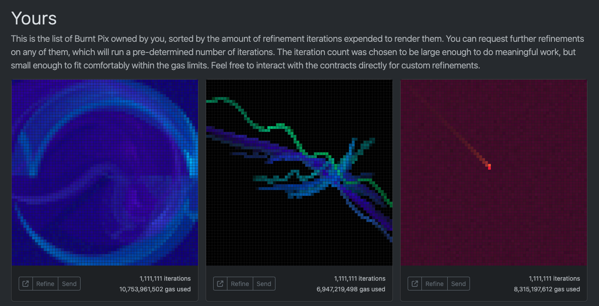

# burnt-pix-bot

A Hardhat repository for automated refindments of Burnt Pix NFTs.



## Installation

**This repository uses the [bun](https://bun.sh) toolkit to manage packages and run scripts.Make sure to [install it](https://bun.sh/docs/installation) first.**

```bash
git clone git@github.com:fhildeb/burnt-pix-bot.git
cd burnt-pix-bot
bun install
```

## Preparation

1. Rename `.env.example` to `.env` and set your `PRIVATE_KEY`
2. Add your `TOKEN_ID` and names to [`/consts/constants.ts`](./scripts/refineBurntPix.ts)
3. Set `burntPix` and `maximumRefines` in [`/scripts/refineBurntPix.ts`](./scripts/refineBurntPix.ts)
4. Adjust `ITERATION_NUMBER` and `MAX_GAS_PRICE` in [`/consts/constants.ts`](./consts/constants.ts)

> **CAUTION**: Never share your private key with anyone or upload it to public repositories. Anyone who possesses it can access your funds, assets, or even gain access to your Universal Profile if the controller has administrative rights! 

## Further Information

- **How to save gas**: Dont call refine transactions using the Universal Profile. It will use significantly more gas because the transaction has to go through the smart contract account. Therefore, provide the `PRIVATE_KEY` of a separate Wallet or the [Universal Profile Controller](https://support.lukso.network/extension/controllers).
- **How to get the token ID** To get the `TOKEN_ID` of your Burnt Pix NFT, connect your Universal Profile or wallet to the [Burnt Pix Webpage](https://burntpix.com/) and click refine. It will pop up a transaction screen showing a `Smart Contract Execution` of `Method: 0xea255583`. The `[0]` value is the token ID of the Burnt Pix and can be copied.
- **How to get Byte32 values**: Both, the `ITERATION_NUMBER` and `TOKEN_ID` values have to be defined as Byte32 values as hexadecimal strings. You can use the [Byte32 Converter](https://neptunemutual.com/web3-tools/number-to-bytes32-converter/) to set custom iterations. Always make sure iterations and token IDs have the `0x` prefix in front.

## Execution

### Starting the Script

```bash
# Mainnet
npx hardhat --network luksoMainnet run scripts/refineBurntPix.ts

# Testnet
npx hardhat --network luksoTestnet run scripts/refineBurntPix.ts
```

### Terminal Output

```text
-----------------------------------------------------------------------------------------------
--- Current Controller:  0xE929859839B0e624f88c169dcAdf5c662967691d
--- Current LYX Balance:  5.219111508945610286
--- Current Gas Price:  1.39763443
--- Getting Metadata for:  0x000000000000000000000000f5603116f71d29e26b9f4cdcc6242a888ccc9900
-----------------------------------------------------------------------------------------------
Iterations: 987000
GasUsed: 7.38B
FeesBurnt: 7.55LYX
TipsPaid: 3.91LYX
-----------------------------------------------------------------------------------------------
--- Checking conditions for refinement...
--- Calling refine...
-----------------------------------------------------------------------------------------------
[23:05:19] Previous refinement is still processing. Skipping this round.
-----------------------------------------------------------------------------------------------
Refine called successfully. Waiting for next round...
```

> **EXIT**: Use `Ctrl+C` to terminate the script.

## References

- [Number to Byte32 Converter](https://neptunemutual.com/web3-tools/number-to-bytes32-converter/)
- [Burnt Pix Benchmark](https://github.com/karalabe/burntpix-benchmark)

#### Mainnet Links

- [Burnt Pix Website](https://burntpix.com/)
- [Burnt Pix Contract](https://explorer.execution.mainnet.lukso.network/address/0x3983151E0442906000DAb83c8b1cF3f2D2535F82?tab=contract)
- [LUKSO Gas Tracker](https://explorer.execution.mainnet.lukso.network/stats)

#### Testnet Links

- [Burnt Pix Website](https://testnet.burntpix.com/)
- [Burnt Pix Contract](https://explorer.execution.testnet.lukso.network/address/0x12167f1c2713aC4f740B4700c4C72bC2de6C686f?tab=contract)
- [LUKSO Gas Tracker](https://explorer.execution.testnet.lukso.network/stats)
